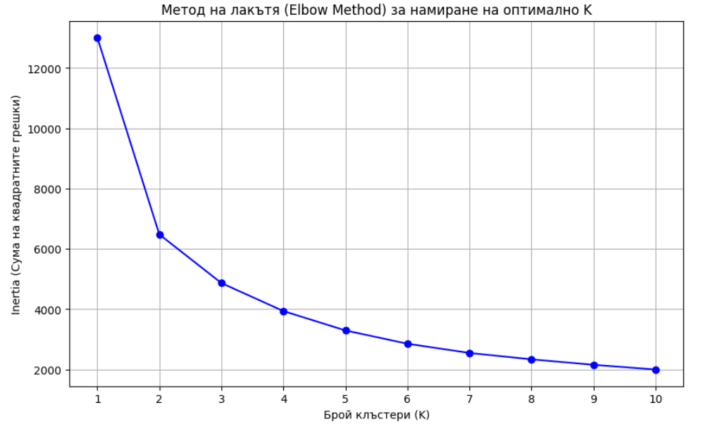
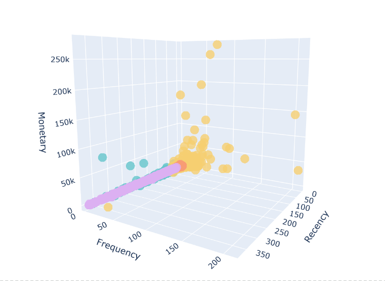

# rfm-customer-segmentation
Python project for customer segmentation using RFM analysis and K-Means clustering algorithms.

# Customer Segmentation & RFM Analysis

 

📊 **View the business presentation [here](Customer_Segmentation_&_RFM_Analysis.pdf
)**

## Project Overview
This project focuses on identifying distinct customer segments based on their purchasing behavior. By calculating **RFM (Recency, Frequency, Monetary)** scores and applying **K-Means Clustering** (an unsupervised Machine Learning algorithm), the model automatically groups customers into actionable business segments (e.g., VIPs, Loyal Customers, At-Risk).

## Key Findings

From 541,909 raw transactions (2010–2011), cleaning removed 135,080 rows with
missing CustomerID plus cancelled/zero-price orders, leaving 397,884 rows and
**4,338 unique customers**.

K-Means (k=4, features log-transformed and standardized with StandardScaler to
handle the heavy right skew of Monetary and Frequency) produced four segments:

| Cluster | Share | Avg. Recency | Avg. Frequency | Avg. Spend | Profile |
|---------|-------|--------------|----------------|------------|---------|
| 1 | 16.5% (716) | 12 days | 13.7 orders | £8,074 | **VIP / Champions** |
| 2 | 27.0% (1,173) | 71 days | 4.1 orders | £1,803 | Regulars cooling off |
| 0 | 19.3% (837) | 18 days | 2.1 orders | £552 | Recent low-spend |
| 3 | 37.2% (1,612) | 183 days | 1.3 orders | £344 | **At-risk / Lost** |

- **The VIP segment drives the business:** only 16.5% of customers generate
  roughly **£5.8M of ≈ £8.9M total revenue (~65%)** — a classic Pareto pattern.
- **The largest segment is the lost one:** 37% of the customer base hasn't
  purchased in ~6 months on average — the primary target for win-back campaigns.
- Cluster 2 is the highest-leverage group: still moderately active (71-day
  recency) but drifting — retention offers here are cheaper than re-acquiring
  cluster 3.

## Data Source
The model uses the **Online Retail Dataset** from the UCI Machine Learning Repository. It contains all the transactions occurring between 2010 and 2011 for a UK-based e-commerce store.

## Business Standard: The RFM Model
In marketing and e-commerce, RFM is a proven behavioral segmentation technique used to analyze customer value:
* **Recency (R)**: How recently did the customer make a purchase? (Measured in days since the last order).
* **Frequency (F)**: How often do they purchase? (Total number of unique transactions).
* **Monetary Value (M)**: How much do they spend? (Total revenue generated by the customer).

## Machine Learning: K-Means Clustering
Instead of manually assigning arbitrary rules for segmentation, this project uses the **K-Means algorithm** to find the optimal customer groupings mathematically. The algorithm calculates the distances between data points and groups similar customers together, revealing hidden patterns in the 3D space of R, F, and M.

**Mathematical Validation:** To avoid arbitrary grouping, the optimal number of clusters (k=4) was mathematically determined using the **Elbow Method**. By calculating the Within-Cluster Sum of Squares (Inertia) across multiple test models, we identify the exact point where adding more clusters yields diminishing returns, ensuring analytical rigor.

## Visualizations

### 1. Optimal Cluster Selection (Elbow Method)
The graph below plots the model's inertia against the number of clusters. The clear "elbow" at k=4 mathematically justifies the decision to divide the customer base into exactly four distinct business segments.

### 2. 3D Customer Segments
The 3D scatter plot visualizes how the K-Means algorithm separates the customer base. The model successfully isolates the "VIP" cluster, characterized by its extreme values: low Recency, high Frequency, and high Monetary spend.

## Tech Stack

* **Python** (Core logic and machine learning)
* **pandas** (Data extraction, cleaning, and aggregation)
* **scikit-learn** (K-Means clustering algorithm)
* **matplotlib & plotly** (Data visualization and 3D modeling)
